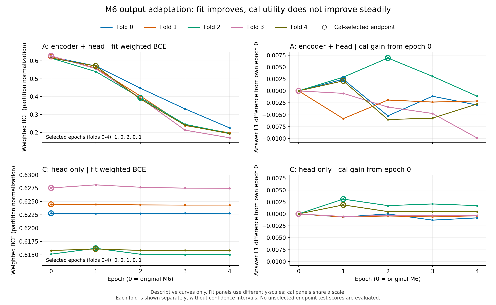

# M6 输出端直接适配：完整实验报告

2026-09-17。**五折两臂训练、统一外层测试、正式独立数值复核及恢复审计均已完成。直接适配 A 相对匹配头控制 C 为−0.001026，98.75%区间[−0.003258，+0.001183]，未达到所需+0.002增量；配方推进门与候选准备门均未通过。** 当前固定四轮方案结束，核心研究目标仍未达到。

本轮确认直接监督 mean6 可以显著改善训练拟合，但没有获得超过匹配控制的所需泛化收益。A相对原M6的区间仍容许+0.002，不能将所有比较都写成排除了所需增量，更不能否定全部M6适配方法。

## 1. 研究问题与已有依据

原 M6 使用冻结 BGE-small 第6层普通 token 均值及效用加权线性头，在已消费旧池上有较弱正向证据，但其完整独立验证未达到预定收益标准。此前将已完成最后层 CLS 微调的 H 改读第6层，也未获得超过原 M6 的所需增量。[完整研究进展](research_progress_report_20260915.md)、[H 读取视图实验](m6_trained_readout_results_20260915.md)

本轮问题是：**从原 M6 的同折完整决策函数出发，让答案效用监督直接作用于第6层均值，更新上游编码器，能否在匹配的训练与选择控制之上提高答案收益？**

这与 H 读取实验的干预不同：H 实验使用已经训练完成的编码器，只改变读取位置并重拟合头；本轮从原始编码器与原 M6 头开始，训练信号直接经过实际决策所用的 mean6 输出。初始化、训练目标、参数范围和选择规则均有区别，因此不将两轮结果之差解释为“训练出口”的单因素因果效应。[设计审查](m6_output_adaptation_design_review_20260915.md)

| 竞争性解释 | 区分它的预定观察 |
|---|---|
| 直接适配较好的原表示，能够增加可泛化的决策信息 | 表示可更新的 A 同时超过原 M6 基线 B 和匹配头控制 C，并达到预定增量 |
| 头更新或有限端点选择足以解释变化 | A 相对 C 没有确认的所需净增量；不能把 A−B 全部归给编码器 |
| 新参数主要提高训练拟合 | fit 损失下降，完整外层答案效用仍没有所需改善 |
| 初始化、梯度或中断恢复实现有误 | 对应实现检查失败；先处理实现问题，不能将其写成科学负结果 |

## 2. 数据、输入与三个比较对象

使用已有 **9,600 条 query、9,559 个 group** 及原五个外层分组划分。每折 fit 6,144、cal 1,536、test 1,920；五折 test 合并覆盖全体 query。[冻结方案](m6_output_adaptation_plan_20260915.md)

监督来自两动作各三次回答的平均答案 F1。定义 `g=F1_BM25−F1_Dense`、`y=I(g>0)`；`|g|>1e−12` 时 `w=|g|`，否则 `w=0`。保留平局行，不重新平衡类别。

模型只输入 query 的固定128 token编码；推理不使用检索结果、probe、gold、支持文档或答案。训练只接收自身 fit 标签；cal 仅参与预定端点选择；全部选择冻结后才统一运行正式 test。

| 对象 | 初始化 | 本轮更新范围 | 比较用途 |
|---|---|---|---|
| B | 原同折 M6 | 无，复用原 OOF 政策 | 保留原始起点，防止仅超过漂移后的控制 |
| C | 原始 BGE 前六层＋原同折 M6 头 | 线性头 weight/bias，共385参数 | 控制 minibatch 优化、头变化和端点选择 |
| A | 与 C 相同 | embeddings、前6个 block及头，共22,565,761参数 | 检验直接适配与选择的完整配方 |

A/C 均显式加载对应的 `fold{f}_M6_head.pt`，不使用全旧池拟合的候选头。第6层普通有效 token 先做 FP32 均值，再 L2 归一化为384维；排除 padding 与 special token，保留普通标点和停用词，没有普通 token 时回退 CLS。原生 BF16 线性分数严格大于0选 BM25，否则选 Dense。编码器维持 `eval()` 关闭 dropout；A 仍保留梯度与实际更新。

**证据边界：** 旧池及其 cal 已多轮参与研究。外层划分隔离本轮梯度和选择，不能消除整个研究历史的选择影响。本轮区间属于条件开发证据，不能充当新来源确认；此前已验证的5,209条及 BEIR test 不进入本轮政策效果评价。推理输入符合检索前约束，也不等于候选已经具备独立验证或部署资格。

## 3. 固定训练预算与四轮选择规则

两臂每批次目标相同：

`mean_batch(w * BCEWithLogits(s,y)) / mean_own_fit(w) + .001 * ||head.weight||² / 2`。

分母固定为完整 own-fit 的平均权重，包含平局行；bias 不罚，正则直接施加于 FP32 master head.weight。全平局批次仍执行正则、optimizer 与学习率步骤。此规则有意保留原 M6 头的显式正则，不能视为旧 H 微调目标的逐步复现。

| 项目 | 预先固定的规则 |
|---|---|
| 优化器 | AdamW，betas=(.9,.999)，eps=1e−8，foreach=False；初始 optimizer state 为空 |
| head | lr=.001，weight_decay=0；梯度范数单独裁剪至1 |
| A encoder | lr=2e−5，weight_decay=.01；bias/LayerNorm.weight不衰减；梯度范数单独裁剪至1 |
| 数值与批次 | FP32 master/optimizer，BF16 autocast，batch8，max_length128 |
| 序列 | 每折 NumPy RNG `2026091517+fold`，每轮遍历完整 fit 排列，两臂顺序相同 |
| 预算 | 每臂每折4 epoch、每轮768步，共3,072步；五折两臂合计30,720有效步骤 |
| 学习率日程 | 第0起始步 `s` 令 `t=s+1`；`t<307` 时倍数 `t/307`，否则 `(3072−t)/(3072−307)`；最后一步lr为0仍计步 |

每臂在 epoch0、1、2、3、4 五个端点中，以 own-cal 上 `mean(g * I(native_logit>0))` 选择全局最大值；与全局最大值相差不超过1e−12时选最早 epoch。阈值固定为0，不另拟合。

epoch0纳入候选使所选 cal 效用在容差内不劣于起点，但**不构成 test 保底**。A/C 的选择候选数量和标签预算一致，不消除校准选择乐观性。A−C比较各自经过同一选择规则后的完整配方，不能解释为固定 epoch 的纯参数因果效应。

十份选择及其 checkpoint 已先冻结，再统一执行各折 test；完整 OOF 预测冻结后才计算政策效应。正式实验完成10条轨迹、40个epoch、30,720有效步骤、50个候选端点，其中5次encoder适配。各分区的描述性加权 BCE 按自身权重和归一，不能直接与历史采用 fit 权重分母的保留损失相减。

## 4. 预先门槛与报告项目

主比较固定为 **A−C、A−B、A−Dense、A−BM25**。共用20,000次按 group 配对重采样，seed2026091519，以每次重采样 query 数作分母。四项 Bonferroni 名义家族95%，单项98.75%区间，分位数为[.00625,.99375]。

- **配方推进门：** A−C 与 A−B 均须点增益≥.002且区间下界>0。
- **候选准备门：** 配方门通过，且 A 对 Dense、BM25 均须点增益≥.01且区间下界>0。
- 门未过即结束这套固定四轮配方，不据 test 扩充 epoch、层位、seed 或范围。通过也仅支持准备独立确认，不代表核心目标完成。

最终结果必须同时报告合并与逐折 F1、各臂所选 epoch、BM25 次数、有益/有害/平局切换与贡献，以及训练和保留损失。不能只报告 A−C、某一折或某一端点。区间跨零不证明无效；固定四轮未通过也不能否定全部 mean6 适配方式。

## 5. 已完成的小试与中断恢复

### 5.1 小试已验证干预和执行路径

小试只用 fold0 fit，两臂各8步。两臂起始的完整6,144条 fit 特征与原 M6 原生分数逐值一致；A 的 embeddings及六个 block均发生模块梯度与实际更新，C 的 encoder参数及表示保持不变；两臂头均更新，保存恢复后的特征与分数精确重放。[小试完整报告](m6_output_adaptation_pilot_results_20260915.md)

独立实现通过原十二层模型第6层 hook 检查输出和梯度，重放两臂合计16步、训练轨迹与最终参数逐值一致。小试及其复核没有评价新 cal/test 效果，也没有据此调节正式配方。该结果证明指定干预能够执行，不证明它提高答案质量。

### 5.2 恢复保持原实验规则

原 session89863/PID7868 已确认消失。旧文件显示 fold0 A/C 完整，fold1 A 保存了 epoch0–3参数和前三轮轨迹，尚无完整 test 或效果产物。[恢复方案](m6_output_adaptation_resume_plan_20260917.md)、[接续记录第21节](research_resumption_20260915.md#21-2026-09-17核实中断并恢复固定适配)

恢复清单绑定38份原文件，完整 fold0直接复用。由于 checkpoint 没有 Adam 状态，fold1 A从同折原 M6重新初始化并重放，不能加载 epoch3参数后以空 optimizer 继续。已核对4份旧 checkpoint 的全部103个 tensor，以及前三轮2,304步轨迹全部数组：值和 dtype 均精确一致。恢复 session81144随后以连续 Adam 状态继续原四轮预算。

原协议、旧文件、模型条件、seed、cal选择、统计规则和容差保持不变。恢复记录已绑定进入正式选择及结果，最终独立恢复审计已通过。它核对38份旧产物保持、11条恢复事件、4个参数一致门与3个轨迹一致门，以及冻结源码和终态绑定；它没有独立再次训练三轮前缀，也不能单靠日志证明完整执行。重放属于执行一致性检查和计算开销，不构成新科学重复。

## 6. 资源：有效训练与重复执行分别计数

本地 RTX4060 Laptop 8GB 单GPU顺序执行；没有新增检索、答案生成或 API 调用。以下正式及恢复数量已由完整记录及恢复审计核对。正式session81144、小试与正式独立检查、最终恢复审计均已真实exit0。

| 范围 | optimizer步骤 | encoder query前向 | 当前口径 |
|---|---:|---:|---|
| 原始小试 | 16 | 12,672 | 已完成；墙钟26.26秒 |
| 小试独立复现 | 16次重放 | 384 | 已完成；墙钟58.37秒，完整十二层模型 |
| 正式逻辑实验 | 30,720 | 649,040 | 五折两臂及预定推理已完成 |
| 恢复进程 | 24,576 | 523,088 | 复用完整fold0，含重复前缀；墙钟2,546.72秒 |
| 两次正式尝试可追溯合计 | 33,024 | 698,192 | 包含重复计算；另有下述未保存计算量范围 |
| 正式独立数值复核 | 0 | 2,320 | 另执行40次首批反向检查；墙钟163.37秒 |
| 最终恢复独立审计 | 0 | 0 | CPU审计；墙钟7.94秒 |

恢复过程包含重放2,304步及49,152次 encoder query前向，其中训练18,432次、四个fit/cal端点30,720次。旧进程在未保存的第4轮还可能执行过0–768步及0–6,144次训练前向，因此不将物理总量写成无不确定性的精确总数。这些前向计数不是独立 query 数。

旧 fold1 A 没有保存完整 fit/cal 分数，恢复已重算；不能声称对这些未保存分数作过逐值对比。结果的 `elapsed_seconds=2546.7169481` 仅代表恢复驱动耗时，含重放，不包含旧完整fold0耗时；不能报告为完整实验的总墙钟时间。恢复进程GPU峰值 allocated **478,204,928 bytes**、reserved **618,659,840 bytes**，结果写入时进程RSS **1,617,629,184 bytes**。这些本地批量执行时间不是在线单query延迟，独立复核也不增加科学重复数。

## 7. 正式结果

### 7.1 四项主比较与预定判断

| 主比较 | 平均答案F1增量 | 98.75%条件区间 |
|---|---:|---|
| A−C | −0.001026 | [−0.003258，+0.001183] |
| A−B（原M6） | −0.000379 | [−0.002892，+0.002057] |
| A−Dense | +0.004417 | [+0.000018，+0.008672] |
| A−BM25 | +0.032451 | [+0.024326，+0.040776] |

**配方推进门=false，候选准备门=false**；固定决策为 `END_FIXED_M6_OUTPUT_ADAPTATION_NO_CONFIRMED_INCREMENT`。[完整结果](../../outputs/router/hotpotqa_bd_router_v1/runs/m6_output_adaptation_v1/results.json)

这四项比较的证据强度不同：A−C上界 **+0.001183** 低于+0.002；A−B上界 **+0.002057** 仍容许+0.002。两者区间均跨零，不能从负点值证明A严格更差。A−Dense下界虽为正，但点值和上界均低于+0.01；它没有达到预定实际收益。A−BM25通过其单项标准，也不能补偿其他门未通过。

### 7.2 全部策略及动作贡献

有益、受损和平局指相对固定Dense改选BM25后的答案差；计数用±1e−12判定。正向与负向贡献均按全9,600条query平均，净增益为二者之差；未切换query不纳入这些三类计数。

| 策略 | F1 | BM25次数 | 有益 | 受损 | 平局 | 正向贡献 | 负向贡献 |
|---|---:|---:|---:|---:|---:|---:|---:|
| A | 0.652626 | 2295 | 312 | 257 | 1726 | 0.020054 | 0.015637 |
| C | 0.653653 | 2461 | 355 | 287 | 1819 | 0.022369 | 0.016925 |
| B | 0.653006 | 2393 | 342 | 278 | 1773 | 0.021137 | 0.016340 |
| Dense | 0.648209 | 0 | 0 | 0 | 0 | 0.000000 | 0.000000 |
| BM25 | 0.620175 | 9600 | 1196 | 1564 | 6840 | 0.069356 | 0.097390 |

A减少了有害切换，也减少了有益切换；正向贡献的损失超过负向贡献的节省，不能据“更少受损”单独判断改进。C点值略高于B，但C−B不是本轮预定主比较，且点增量约+0.000647；**不据此自动将C晋升为候选**。

### 7.3 逐折选择与完整外层结果

每折1,920条，fold编号沿用产物的0–4。A选择[1,0,2,0,1]，C选择[0,0,1,0,1]；两臂在fold1、fold3均回退原M6的epoch0。

| fold | 所选epoch A/C | A F1 | C F1 | B F1 | A−C | A−B | A−Dense | A−BM25 |
|---|---|---:|---:|---:|---:|---:|---:|---:|
| 0 | 1/0 | 0.662020 | 0.664610 | 0.664610 | −0.002591 | −0.002591 | +0.005470 | +0.033099 |
| 1 | 0/0 | 0.649709 | 0.649709 | 0.649709 | +0.000000 | +0.000000 | +0.005098 | +0.037615 |
| 2 | 2/1 | 0.652194 | 0.652612 | 0.648291 | −0.000418 | +0.003903 | +0.000284 | +0.027383 |
| 3 | 0/0 | 0.649304 | 0.649304 | 0.649304 | +0.000000 | +0.000000 | +0.004948 | +0.032924 |
| 4 | 1/1 | 0.649906 | 0.652030 | 0.653115 | −0.002124 | −0.003209 | +0.006285 | +0.031237 |

A在实际选择适配端点的三折中，相对C点增益均为负；相对B为一正两负。该描述不把五折当作五次独立研究，也没有为未选端点计算test曲线。

### 7.4 拟合改善与校准效用的分离

图为**描述性曲线**：上排A、下排C；左列fit加权BCE，右列cal相对自身epoch0的答案F1变化，空心圆为cal所选端点。左列两图纵轴尺度不同，右列共用尺度。逐折单独展示，不添加将fold视为独立重复的区间，不推断未选端点test效果。[可导出SVG](figures/m6_output_adaptation_fit_cal_20260917.svg)、[绘图与读取核对代码](../../scripts/plot_m6_output_adaptation.py)

| fold | 共同起点fit BCE | A epoch4 fit BCE | C epoch4 fit BCE | A epoch4 cal BCE | C epoch4 cal BCE | A所选test BCE | C所选test BCE |
|---|---:|---:|---:|---:|---:|---:|---:|
| 0 | 0.622777 | 0.225299 | 0.622792 | 1.067837 | 0.646225 | 0.687153 | 0.652647 |
| 1 | 0.624468 | 0.197850 | 0.624329 | 1.014527 | 0.657801 | 0.635285 | 0.635285 |
| 2 | 0.615103 | 0.195022 | 0.614997 | 1.042389 | 0.653219 | 0.776926 | 0.669491 |
| 3 | 0.627545 | 0.170276 | 0.627487 | 1.085969 | 0.643180 | 0.646449 | 0.646449 |
| 4 | 0.615789 | 0.193409 | 0.615812 | 1.134879 | 0.663538 | 0.703731 | 0.660511 |

A在五折中均随训练降低fit BCE，epoch4降至0.170276–0.225299；同一端点的cal BCE升至1.014527–1.134879，且其cal答案效用均低于自身epoch0。C的fit BCE则基本保持在原起点附近。固定cal规则选择了较早端点或回退起点；这避免了直接采用epoch4，却仍没有取得超过C的所需外层收益。

这些现象支持“新增训练拟合没有转为所需泛化收益”的解释；它们不能唯一归因于标签噪声、模型容量、表示损坏或校准集选择波动。尤其不能仅由损失差距宣布query信息不足。

## 8. 可信度、判断更新与下一步

### 8.1 两项终态复核已经通过

[正式独立检查](../../outputs/router/hotpotqa_bd_router_v1/runs/m6_output_adaptation_v1/separate_checks.json)核对50份checkpoint、40份训练轨迹的30,720步、40个首步头梯度公式、10份fit/cal缓存、10项端点选择，以及完整政策与四项效应。

- 180个分数向量、251,920个分数通过与实际BF16路径相符的数值界；不能将BF16分数误差误写为理想FP64零误差。
- 用完整十二层模型的默认forward与第6层hook独立检查2,320次query前向、40次首批反向；抽样原生分数、保存表示、头梯度及全部可训练参数梯度范数均精确复现。FP64池化最大差8.504513e−8。
- 20,000次bootstrap全部核对，最大差1.804112e−16；其余标量检查最大误差4.440892e−16。
- 没有更改存储dtype、科学规则或数值容限；没有完整重训全部正式轨迹或重放全部649,040次前向，检查范围不能夸大为全训练独立复制。

[恢复审计](../../outputs/router/hotpotqa_bd_router_v1/runs/m6_output_adaptation_v1/recovery_separate_checks_20260917.json)另外核对38份旧文件保持、原6份源码/计划与19份输入、两份恢复源码/方案、精确重放门及资源推导。其证明边界已在第5节说明。

`results.json`中的`pending_independent_check`是该冻结结果写入时的状态快照；后来两份独立收据均通过。没有改写旧结果字段来制造单文件“成功状态”。本报告及图另以CPU从保存预测重算30份合并/逐折政策汇总、24个主比较均值、50候选的fit/cal指标及10项选择，未运行GPU或新增test推理。

### 8.2 本轮如何改变判断

| 解释 | 本轮更新 |
|---|---|
| 直接适配M6能够获得所需匹配净收益 | 当前固定配方被削弱；A−C区间上界低于预定+0.002 |
| 头更新或有限选择足以解释适配的表面收益 | 保持可行；A没有超过C，不能将相对Dense的正增益归给表示适配 |
| 新训练主要增加fit拟合 | 得到描述性支持；fit下降伴随cal损失上升，但没有唯一定位成因 |
| 初始化或恢复错误造成当前结果 | 指定检查范围内未发现，已完成数值与恢复独立复核；仍不声称形式化证明全部执行 |

当前结束固定四轮、既定参数范围和五端点选择的方案。不继续根据已见test选择更多epoch、层位或seed，不自动晋升C；本轮无新可部署候选。

### 8.3 接下来应回答的问题

1. 将“表示能拟合”与“答案效用目标及其校准选择能否泛化”分开，结合已有跨重复结果和目标归一化分析，先设计能够区分剩余解释的受控问题；这些是下一轮假设，尚未获得训练证据。
2. 在投入新的独立确认前核实来源资格。[主报告第7.3节](research_progress_report_20260915.md)记录了官方隐藏test的元信息预查：逐query配对评分能力及现有gold-based group映射尚未认证，不能称为合格确认来源。
3. 只有后续候选先通过明确的开发推进门，才冻结独立来源、评分、两固定基线和预算；检索前输入资格、内部区间和实现通过均不能替代这一层证据。

核心目标保持不变：在目标query分布上，仅凭query选择检索器并稳定提高最终答案质量。当前证据未证明该目标已经达到。

## 9. 证据入口

- [原冻结协议](../../outputs/router/hotpotqa_bd_router_v1/runs/m6_output_adaptation_v1/protocol.json)：SHA256 `11237536b48159ff9071d2ab140e385f8adba172b5243c449ba0006af5bb35d6`。
- [冻结实验方案](m6_output_adaptation_plan_20260915.md)、[小试及独立复核报告](m6_output_adaptation_pilot_results_20260915.md)。
- [恢复方案](m6_output_adaptation_resume_plan_20260917.md)、[恢复清单](../../outputs/router/hotpotqa_bd_router_v1/runs/m6_output_adaptation_v1/resume_manifest_20260917.json)：清单SHA256 `786cf18fd03ac25ecf6d683136b69b84616e4b11628761da268a30006f1d66f4`。
- [正式数值检查入口](../../scripts/check_m6_output_adaptation_formal.py)、[独立恢复审计入口](../../scripts/check_m6_output_adaptation_recovery.py)。

| 完成产物 | SHA256 |
|---|---|
| results.json | `fe174272dc4efaea7c57c016b8cccc9b3b325711227246b2d44d7d714793daca` |
| predictions.npz | `74cf0b33cce283737886ce13d72ad1f674efc34b553d13972ad432442f30e126` |
| separate_checks.json | `0f8687a00c97cc3f919f70d66267429906032927dbffe94938b2650cf3f3b883` |
| recovery_separate_checks_20260917.json | `a58cc0997e5c789c547c453e0ec3e8e8281bdb5914394120f4ce8a61e8c75a66` |

四份摘要均由报告编写时重新读取当前文件计算。图绑定同一results摘要，绘图及报告没有修改冻结产物。
